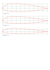

# naca-airfoil

Python port of an original QBasic application discovered at https://m-selig.ae.illinois.edu/ads.html by David Lednicer | "Applied Computational Fluid Dynamics"

This port covers 5 digit NACA profiles with a 2 digit modification code (other profiles are not ported)

the five digit profiles are decently described here: http://airfoiltools.com/airfoil/naca5digit but the tools there do not cover modifications

The basic version includes code to cover the modified profile case. A modification consists of 2 additional controlling parameters usually specified by
appending a hyphen and the digits to a 5 digit specification eg: 23018-53. The first digit controls the leading edge radius, 6 indicates the same radius 
as the basic 5 digit NACA profile 0 is a sharp (no radius) leading edge and numbers higher than 6 indicate more leading edge rounding. The second digit 
indicates the distance from the leading edge toward the trailing edge in 1/10ths of the chord length (unit in this case) of the maximum thickness of the 
profile. So a second digit of 3 indicates the maximum thickness occurs 0.3 * chord length back from the leading edge, and 5 would place it half way back. 
0.3 is the default for a 5 digit profile. So to generate a basic, no modification profile equivalent use a modification specification of -63.

I have included a leading edge droop calculation which moves the leading edge over a specified distance (1/10 of the chord length) I have no documentation 
to support this and simply shift both upper and lower surfaces by the given amount at the leading edge falling off as the square of the distance to the 0 point.
Specify a droop of zero to ignore this code. The King air C90 family apparently have a leading edge droop (fixed not a moveable flap) built into the inner 
portion of the wing (between the nascelles) my understanding is that this droop was deleted from the King air 350, but applies to all other variants. I have no 
information of how great this droop is.

The code produces an svg output file airfoil.svg in the current folder

